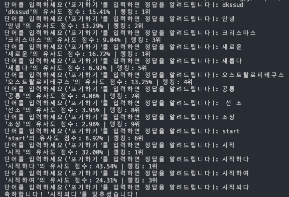
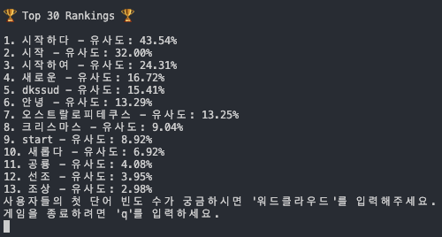
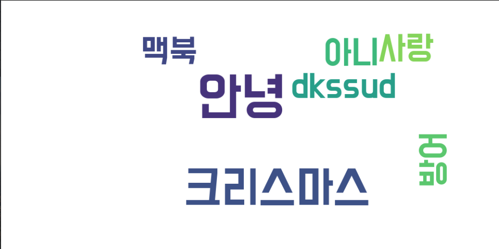

# YOU CHOO?
### 인공지능이 생각하고 있는 단어는 무엇일까요?

## overview

<table>
  <tr>
    <td></td>
    <td></td>
    <td></td>
  </tr>
</table>

인공지능이 생각하고 있는 단어를 인간이 맞추는 프로그램입니다. 정답 단어를 추측하면, 추측한 단어가 정답 단어와 얼마나 유사한지 점수로 알려주게 됩니다. 오늘은 인공지능이 어떤 단어를 생각하고 있을까요? You Quiz? 아니 **You Choo?**

## steps
1. FastText 모델을 로드하여 오늘의 단어를 선택합니다.
2. 사용자는 아무 단어나 입력하며 계산된 유사도를 보고 추측한다.
3. 포기하기를 입력하면 그 즉시 답을 알 수 있다.

## notice

- 정답은 명사와 동사, 부사 만을 포함합니다.
- 유사도는 FastText로 Pre-trained된 모델을 사용합니다.
- 유사도는 단어의 철자가 비슷한 것이 아닌 의미에 대한 유사도입니다.
>> 예를 들어 나는 00에 간다. 00 안에 들어가는 단어는 수도없이 많습니다.

## output
<table>
  <tr>
    <td></td>
    <td></td>
    <td></td>
  </tr>
</table>

## 해야할 것
- [x] 사용자들의 첫 단어 -> 두 번째 단어 빈도 수 통계 -> 워드클라우드로 나타내기
- [x] 웹사이트로 아이디어 발전
- [x] 도전 횟수 업데이트 기능
- [ ] n번 만에 맞추면 선물?? 
- [x] 유사도 점수 랭킹 저장
- [x] 전체 사용자 랭킹 db 개발
- [ ] 사용자 랭킹 시스템 top5 -> n번째만에 맞추셨습니다. 랭킹은 n위입니다.
- [x] 1초에 한 번씩 워드클라우드 업데이트
- [x] 워드클라우드 오전 12시 되면 초기화
- [x] 영어 입력 alert to gameinfo()

## How to use

~~~
pip install schedule fasttext scikit-learn wordcloud matplotlib flask redis
~~~
- [FastText](https://fasttext.cc)에 들어가서 한국어 모델을 다운로드 하셔서 bin 파일을 프로젝트 폴더에 넣어주시면 됩니다.
- 사용을 못한다면 sentences.json에서 굉장히 많은 문장을 추가한 다음 train/train.py를 실행시켜 단어를 추출하면 됩니다.