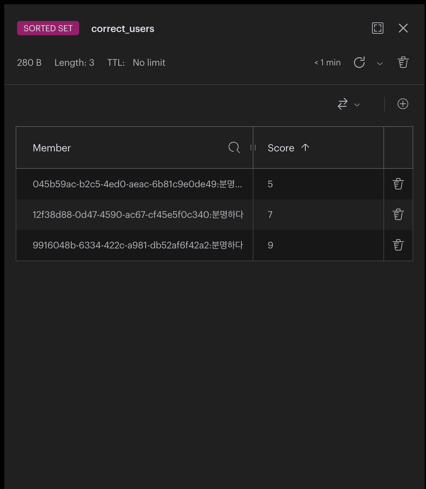

# YOU CHOO?
### 인공지능이 생각하고 있는 단어는 무엇일까요?

## overview

<table>
  <tr>
    <td></td>
    <td></td>
    <td></td>
  </tr>
</table>

인공지능이 생각하고 있는 단어를 인간이 맞추는 프로그램입니다. 정답 단어를 추측하면, 추측한 단어가 정답 단어와 얼마나 유사한지 점수로 알려주게 됩니다. 오늘은 인공지능이 어떤 단어를 생각하고 있을까요? You Quiz? 아니 **You Choo?**

## steps
1. FastText 모델을 로드하여 오늘의 단어를 선택합니다.
2. 사용자는 아무 단어나 입력하며 계산된 유사도를 보고 추측한다.
3. 포기하기를 입력하면 그 즉시 답을 알 수 있다.

## notice
- 정답은 명사와 동사, 부사 만을 포함합니다.
- 유사도는 FastText로 Pre-trained된 모델을 사용합니다.
- 유사도는 단어의 철자가 비슷한 것이 아닌 의미에 대한 유사도입니다.
>> 예를 들어 나는 00에 간다. 00 안에 들어가는 단어는 수도없이 많습니다.

## output(YouChoo?.py)
<table>
  <tr>
    <td></td>
    <td></td>
    <td></td>
  </tr>
</table>

## How to use

~~~
pip install schedule fasttext scikit-learn wordcloud matplotlib flask redis
~~~
- [FastText](https://fasttext.cc)에 들어가서 한국어 모델을 다운로드 하셔서 bin 파일을 프로젝트 폴더에 넣어주시면 됩니다.
- 사용을 못한다면 sentences.json에서 굉장히 많은 문장을 추가한 다음 train/train.py를 실행시켜 단어를 추출하면 됩니다.
  
~~~
redis-server
~~~
- flask 서버 실행하기 전에 Redis 서버를 실행해줘야 합니다. (랭킹 DB 업로드)
  
~~~
python project/app.py
~~~
<table>
  <tr>
    <td></td>
    <td></td>
    <td></td>
  </tr>
</table>


## features
- 오늘의 워드 클라우드
- 단어 유사도 계산
- 유사도 랭킹 테이블
- 사용자 랭킹 DB
- 게임은 하루에 한 번씩
- 오전 12시 초기화


## 해야할 것
- [x] 사용자들의 첫 단어 -> 두 번째 단어 빈도 수 통계 -> 워드클라우드로 나타내기
- [x] 웹사이트로 아이디어 발전
- [x] 도전 횟수 업데이트 기능
- [x] 유사도 점수 랭킹 저장
- [x] 전체 사용자 랭킹 db 개발
- [x] 사용자 랭킹 시스템 top5 -> n번째만에 맞추셨습니다. 랭킹은 n위입니다.
- [x] 1초에 한 번씩 워드클라우드 업데이트
- [x] 워드클라우드 오전 12시 되면 초기화
- [x] 영어 입력 alert to gameinfo()
- [ ] t-SNE 사용-> 유사도를 더 시각적으로 확인
- [ ] 힌트 기능: 

## Deployment (CI/CD)

Follow these steps to enable automatic build & deploy from GitHub Actions.

- Required repository secrets (Settings → Secrets → Actions):
  - `GITHUB_TOKEN` — provided by GitHub automatically (used by Actions).
  - `DEPLOY_HOST` — remote server IP or hostname.
  - `DEPLOY_USER` — SSH user on the remote host (e.g., `ubuntu`).
  - `DEPLOY_SSH_KEY` — private SSH key (PEM) for `DEPLOY_USER` (add as secret, do NOT add passphrase).
  - (optional) `REMOTE_COMPOSE_PATH` — path to `docker-compose.yml` on the remote host (e.g. `/home/ubuntu/youchoo/docker-compose.yml`).
  - (optional) `MODEL_URL` — public or signed URL where the FastText `.bin` is stored (S3, object storage). If set, the container entrypoint will download the model at startup.

- How it works:
  1. Push to `main`/`master` triggers `.github/workflows/ci.yml`.
 2. Action builds the Docker image from `project/Dockerfile` and pushes to GitHub Container Registry `ghcr.io/<owner>/youchoo`.
  3. If `DEPLOY_*` secrets are set, the workflow SSHes to your `DEPLOY_HOST` and pulls the new image. If `REMOTE_COMPOSE_PATH` exists on the host the workflow will run `docker-compose pull` and `docker-compose up -d`; otherwise it will run the container with `docker run -d`. If you set `MODEL_URL` as a repo secret, the deploy step will pass it to the remote process (as `MODEL_URL`) so the container entrypoint can download the large FastText `.bin` at startup.

- Quick local steps to finalize:
  - Make the deploy helper executable locally:
    ```bash
    chmod +x ./scripts/deploy.sh
    ```
  - Add the required GitHub secrets in repository settings.
  - Push changes; the GH Actions workflow will run and (if secrets present) deploy automatically.

If you'd like, I can add a second workflow that only runs on release tags, or add Docker Hub support instead of GHCR.

### Quick verification (local)

1. Build the image locally (from repo root):
```bash
docker build -t youchoo-local:latest -f project/Dockerfile project
```

2. Run locally (bind port 8000):
```bash
docker run --rm -p 8000:8000 youchoo-local:latest
```

3. Test the app at `http://localhost:8000`.

### Helpful notes and security

- Create a dedicated deploy SSH key on your server and add the **public** key to `~/.ssh/authorized_keys` for `DEPLOY_USER`. Store the **private** key as the `DEPLOY_SSH_KEY` repository secret.
- Prefer restricting the deploy key to a single user and directory; do not reuse your personal keys.
- For extra security, consider using GitHub Actions OIDC or a short-lived token instead of long-lived SSH keys.

If you want, I can add a separate `release.yml` that only builds images when you push a Git tag, or I can add DockerHub support instead of GHCR.

### Uploading the model to S3 and creating a presigned URL

You can upload your FastText `.bin` model to S3 and create a short-lived presigned URL to use as `MODEL_URL` in GitHub secrets. Example helper script is included at `scripts/upload_model_to_s3.py`.

Prerequisites:
- `aws` credentials configured locally (via `~/.aws/credentials` or environment variables `AWS_ACCESS_KEY_ID`/`AWS_SECRET_ACCESS_KEY`).
- `boto3` installed: `pip install boto3`.

Example usage:
```bash
python scripts/upload_model_to_s3.py --file project/model/cc.ko.300.bin --bucket my-bucket --key models/cc.ko.300.bin --expiry 3600
```

This prints a presigned `MODEL_URL`. Copy that value and add it to GitHub repository secrets as `MODEL_URL` (set a short expiry for security).